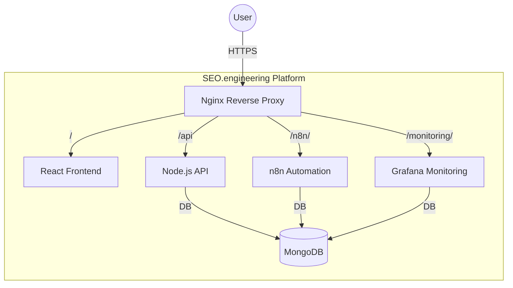

# SEO.engineering Platform Demo Plan

## Objective

Showcase the SEO.engineering platform in its intended form: running all core services (frontend, backend, automation, database, monitoring) via the official launch process, and demonstrate the main user-facing experience.

---

## Step 1: Prerequisite Checks

- **System Requirements:**  
  - Docker & Docker Compose installed and running  
  - Node.js 18+ (for local scripts, not needed for Dockerized demo)  
  - Ports 80 and 443 are free (no other web servers running)

- **Environment Files:**  
  - Ensure `.env.production` exists in the project root (copy from `deployment/.env.example` if needed, and set at least `DOMAIN=localhost` and `CANONICAL_URL=http://localhost`).

- **SSL Certificates:**  
  - The script expects SSL certs in `nginx/ssl/seo.engineering.crt` and `.key`.  
  - If missing, it tries to copy from `/home/tabs/SEO.engineering/deployment/nginx/ssl/`.  
  - If not available, the script will exit—so ensure these files exist or adjust the script for local demo (can use self-signed certs for localhost).

---

## Step 2: Launch the Platform

- Run the official launch script from the project root:
  ```bash
  ./launch-seo-engineering.sh
  ```
  - This will:
    - Verify environment and SSL setup
    - Prepare Nginx config and directories
    - Stop any system Nginx to avoid port conflicts
    - Bring up all services via Docker Compose (`deployment/docker-compose.prod.yml`)
    - Output access URLs and credentials

---

## Step 3: Verify All Services Are Running

- **Main Website (Frontend):**  
  - Accessible at: `https://seo.engineering` (or `https://localhost` if configured for local demo)
  - Should show the React-based UI

- **API:**  
  - Accessible at: `https://seo.engineering/api`  
  - Can verify with a browser or curl

- **Workflow Studio (n8n):**  
  - Accessible at: `https://seo.engineering/n8n/`

- **Monitoring Dashboard (Grafana):**  
  - Accessible at: `https://seo.engineering/monitoring/`

- **Credentials:**  
  - Username: `admin`  
  - Password: `admin123` (default, change after first login)

---

## Step 4: Demo the Platform

- **Open the Main Website in a Browser:**  
  - Show the landing page and main UI features.
  - Optionally, log in with the default credentials if authentication is enabled.

- **Show API/Automation/Monitoring:**  
  - Optionally, demonstrate API endpoints or monitoring dashboards.
  - Optionally, trigger a sample SEO audit or workflow if available from the UI.

---

## Step 5: (Optional) Run Automated Tests

- If you want to show test coverage:
  - Frontend:  
    ```bash
    cd website && npm test
    ```
  - Backend:  
    ```bash
    cd api && npm test
    ```

---

## Step 6: Troubleshooting

- If any service fails to start, check logs:
  ```bash
  docker compose -f deployment/docker-compose.prod.yml logs -f
  ```
- Common issues: missing env vars, SSL certs, port conflicts, Docker not running.

---

## Architecture Diagram



---

## Summary of Demo Flow

1. Prepare environment and SSL certs.
2. Run `./launch-seo-engineering.sh`.
3. Wait for all containers to be healthy.
4. Open the main website in a browser (https://seo.engineering or https://localhost).
5. Optionally, show API, n8n, and monitoring dashboards.
6. (Optional) Run tests for frontend/backend.