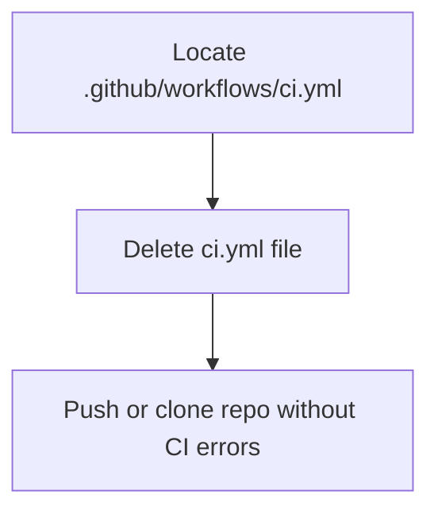

# Plan to Remove GitHub Actions CI Workflow from SEO.engineering Project

## Objective
Disable the GitHub Actions CI pipeline that causes errors during repository uploads and cloning, especially when deploying to Google Cloud VM.

---

## Context
- The project contains a GitHub Actions workflow at:
  
  ```
  .github/workflows/ci.yml
  ```

- This workflow triggers automated CI checks on push and pull requests.
- The CI pipeline currently fails, blocking smooth cloning and deployment.

---

## Solution Overview



---

## Step-by-Step Plan

1. **Locate the Workflow File**

   - Path: `.github/workflows/ci.yml`

2. **Delete the Workflow**

   - Remove the file `.github/workflows/ci.yml` from the repository.
   - This disables all automated CI runs on GitHub.

3. **Push Changes**

   - Commit and push the deletion to GitHub.
   - Future pushes/clones will **not** trigger CI, avoiding errors.

4. **Optional: Adjust Branch Protection**

   - If branch protection rules require CI status checks, update or remove them in GitHub repository settings.

---

## Expected Outcome

- GitHub will **no longer run CI checks** on this repository.
- You can **clone, push, and deploy** the project without CI-related interruptions.
- You can re-enable CI later by re-adding or fixing the workflow.

---

## Notes

- This plan **does not fix** underlying code/test issues, only disables CI.
- For production readiness, consider fixing tests and re-enabling CI in the future.