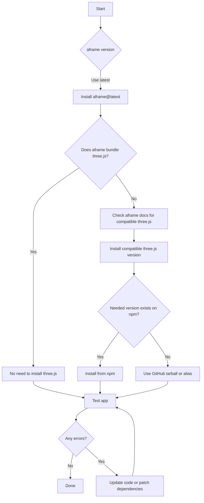

# aframe & three.js Compatibility Plan

## Objective

Establish a robust, future-proof method for using the most stable and compatible versions of aframe and three.js in the website frontend, including strategies for handling missing npm versions, dependency conflicts, and breaking API changes.

---

## 1. Compatibility Strategy

- **aframe**: Use the latest stable version, unless a specific version is required for compatibility.
- **three.js**: Use the latest version compatible with aframe, as specified in aframe’s documentation or release notes.
- **If aframe bundles three.js**: No need to install three.js separately unless you use it directly.
- **If a required three.js version is not on npm**: Use npm aliases or GitHub tarballs (see below).

---

## 2. Using npm Aliases and GitHub Tarballs for three.js

### a. Using an npm Alias

If a package expects a forked or aliased version (e.g., `super-three`):

```json
"dependencies": {
  "three": "npm:super-three@0.173.5"
}
```
This tells npm to install `super-three` but make it available as `three`.

### b. Using a GitHub Tarball

If a specific version or commit of three.js is needed:

```json
"dependencies": {
  "three": "github:mrdoob/three.js#<commit-or-tag>"
}
```
Replace `<commit-or-tag>` with the desired commit hash or tag.

---

## 3. Automating Compatibility Checks

### a. Use `npm-check-updates` (ncu)

- Install globally: `npm install -g npm-check-updates`
- Run in your project: `ncu -u` (updates package.json to latest compatible versions)
- Combine with `npm outdated` to see mismatches.

### b. Custom Compatibility Script

Create a script to:
- Check aframe’s peerDependencies for three.js.
- Compare installed versions.
- Alert if incompatible.

Example (pseudo-code):

```js
const aframe = require('aframe/package.json');
const three = require('three/package.json');
if (!semver.satisfies(three.version, aframe.peerDependencies.three)) {
  console.error('Incompatible three.js version!');
  process.exit(1);
}
```

### c. GitHub Actions Workflow

Automate checks on PRs:
- Use a workflow to run `npm install` and `npm test`.
- Optionally, add a step to check for outdated or incompatible dependencies.

---

## 4. Handling Breaking API Changes

- **Monitor Release Notes**: Always check aframe and three.js release notes before upgrading.
- **Test Thoroughly**: After any upgrade, run your app and automated tests.
- **Update Code**: Refactor any code using deprecated or changed APIs.
- **Pin Versions**: If breaking changes cause issues, pin to the last known working version until code can be updated.
- **Community Resources**: Check GitHub issues and forums for migration guides.

---

## 5. Installation & Update Flow



---

## 6. Summary Table

| Step | Action | Rationale |
|------|--------|-----------|
| 1 | Check aframe’s latest version and three.js compatibility | Ensures stability |
| 2 | Install aframe@latest | Use most up-to-date features |
| 3 | Only install three.js if needed and compatible | Avoids conflicts |
| 4 | Use alias/tarball if npm version missing | Handles edge cases |
| 5 | Use resolutions/overrides if needed | Forces dependency tree to comply |
| 6 | Test and patch code | Ensures runtime stability |
| 7 | Automate compatibility checks | Prevents future breakage |

---

## 7. References

- [aframe releases](https://github.com/aframevr/aframe/releases)
- [three.js releases](https://github.com/mrdoob/three.js/releases)
- [npm-check-updates](https://www.npmjs.com/package/npm-check-updates)
- [npm alias documentation](https://docs.npmjs.com/cli/v9/configuring-npm/package-json#alias-urls)
- [GitHub tarball dependencies](https://docs.npmjs.com/cli/v9/configuring-npm/package-json#github-urls)