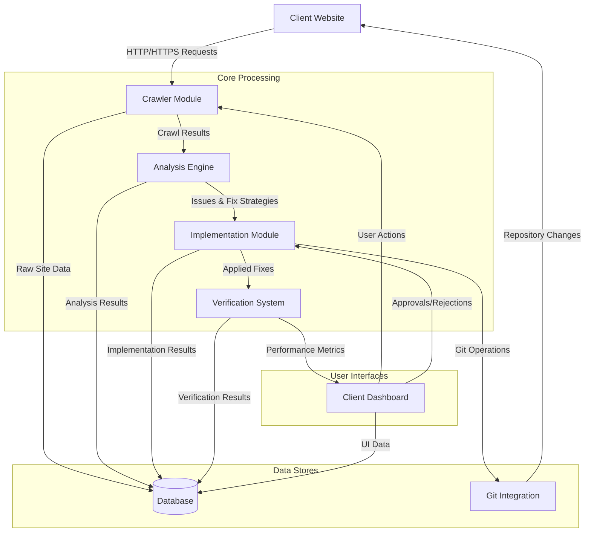
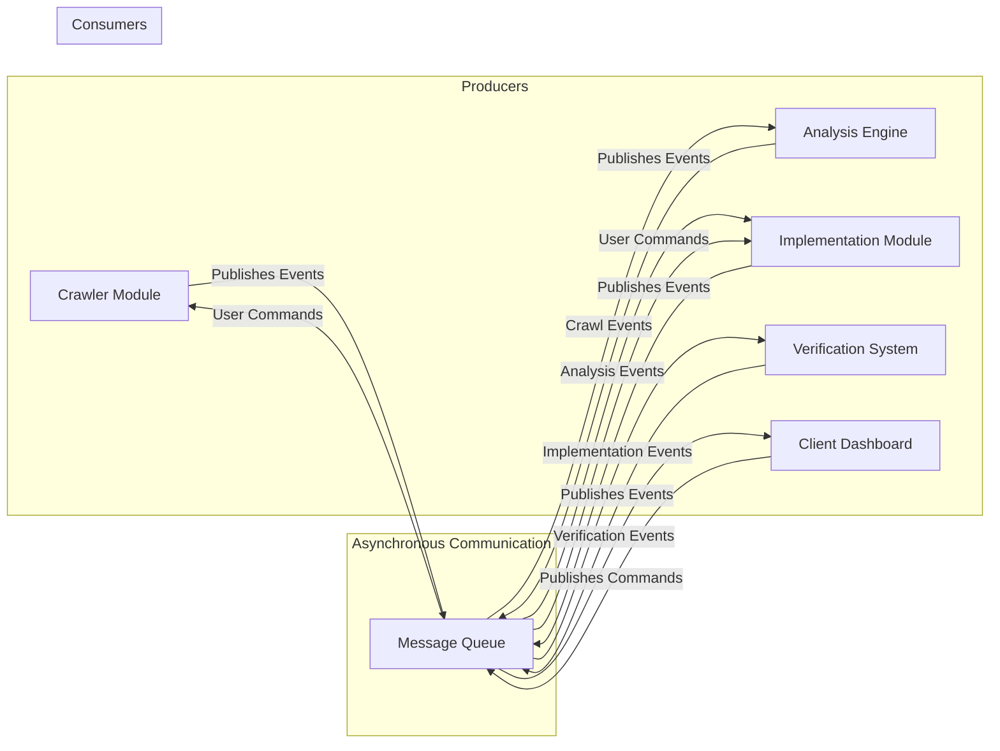
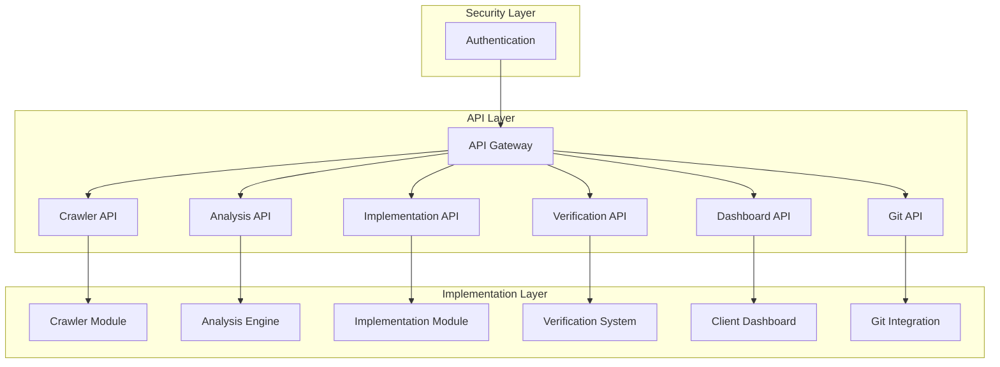
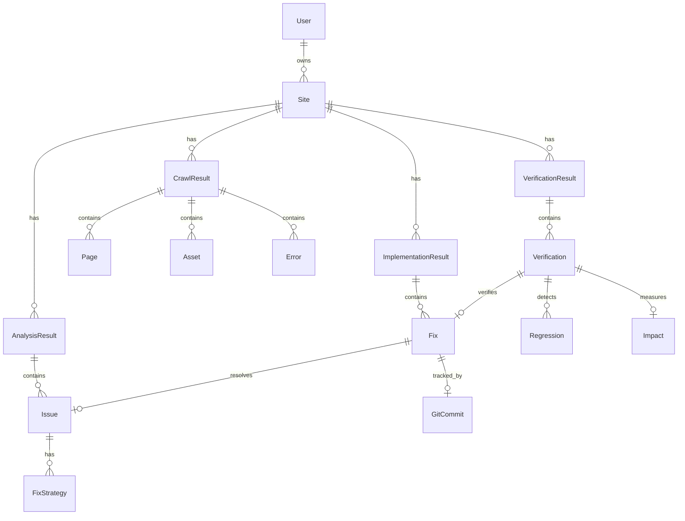
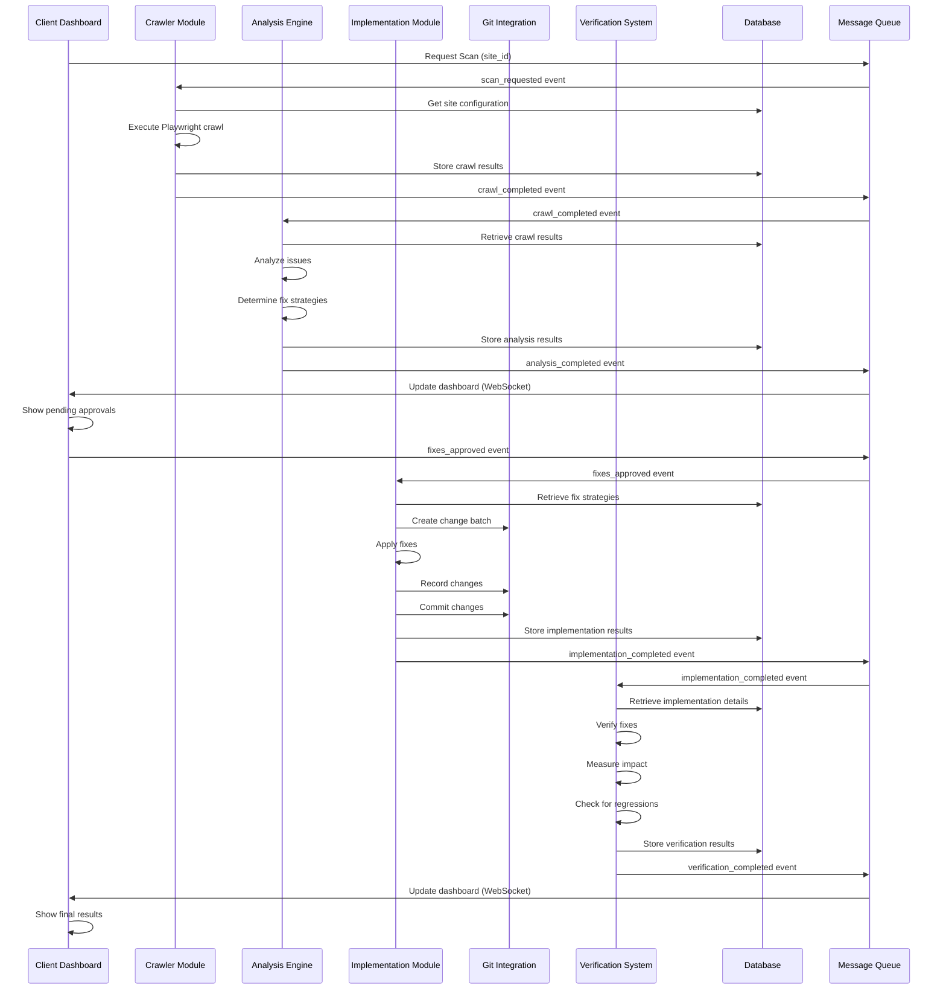
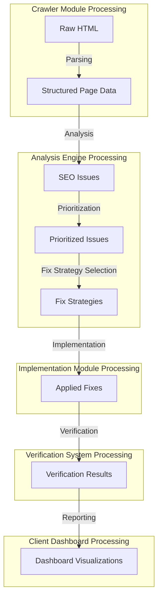
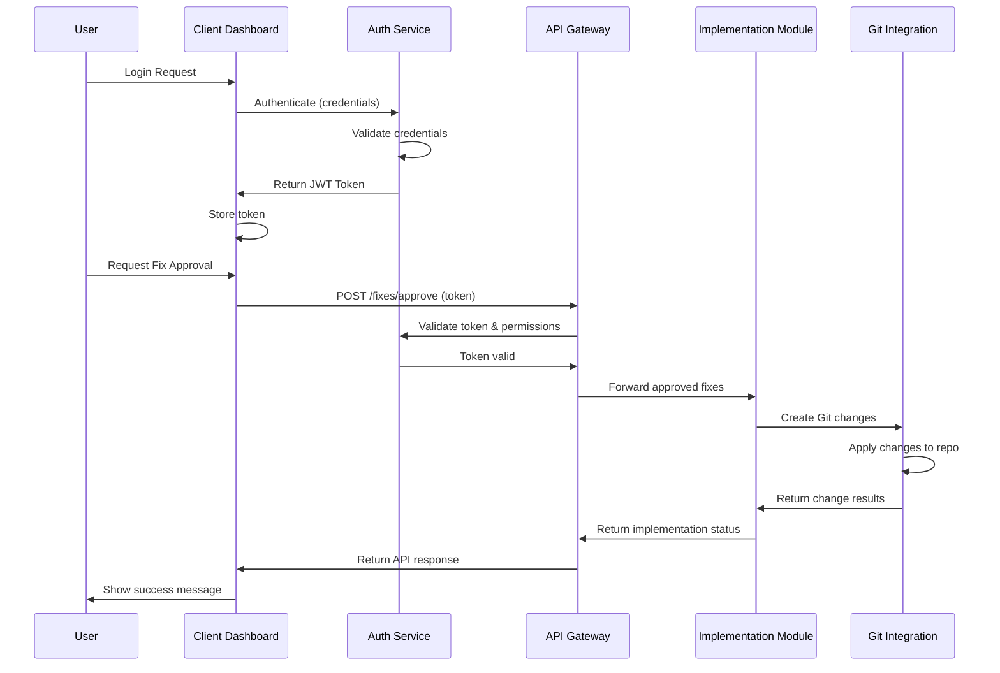

# SEOAutomate Data Flow Diagrams

This document provides visual representations of the data flows between SEOAutomate modules, highlighting the specific integration points and communication patterns.

## Primary System Data Flow

## Message Queue Communication Flow

## API Integration Map

## Database Entity Relationships

## Complete Process Workflow

## Data Transformation Flow

## Security and Authentication Flow

This document complements the Module Integration Points documentation by providing visual representations of the data flows, making it easier to understand the complex interactions between system components.
